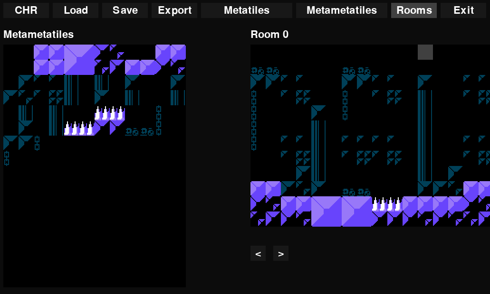

# chredit

This is a simple editor for metatiles, metametatiles, and rooms for homebrew NES games. This was written to adapt to my workflow. It is originally intended to be incorporated in games written in C (using libraries like neslib and nesdoug) but the output can probably be adapted for assembly as well.

I may add more features in the future. For now, it's not possible to edit the CHR files themselves - for that, you can use tools like YY-CHR. Feel free to fork the project and make the changes that suit your needs.

## Installation

Make sure you have tkinter installed:

```bash
sudo apt-get install python3-tk
```

Create a virtual environment and install the requirements:

```bash
python3 -m venv venv
source venv/bin/activate
pip install -r requirements.txt
```

Please note that pygame versions later than 2.1.2 cause a bug when opening files, hence the choice for the older version.

Run the application:

```bash
python3 main.py
```

## Purpose

Since a typical NES rom has a limited amount of space (40 kB), it's crucial to optimize the use of graphics. Let's assume we are using 64x48 tile "rooms" to compose each level. If the information for each room was stored tile by tile, we would need over 3 kB per room - quickly exhausting the available space. This is typically soved using metatiles, which allow us to represent rooms with 16x12 metatiles (192 bytes). We can optimize this further by using metametatiles, which allow us to represent rooms with only 8x6 metametatiles (48 bytes). An excellent example of this technique can be seen [here](https://www.youtube.com/watch?v=ZWQ0591PAxM&t=4s).

## Menu

* `CHR` Open CHR file.
* `Load` Load a project file.
* `Save` Save the project to file.
* `Export` Export the project (palette, metatiles, metametatiles, rooms) to C header files. Select a folder to save the files.
* `Metatiles` Edit metatiles.
* `Metametatiles` Edit metametatiles.
* `Rooms` Edit rooms.
* `Exit` Exit the application.

## Screenshots




## Instructions

Select the elements on the left panel and add them to the right panel to assemble your meta-elements. For the metatiles, you can choose a palette from the bottom left. Palettes themselves can be edited by selecting one of the colors and changing it from the color picker on the bottom right.